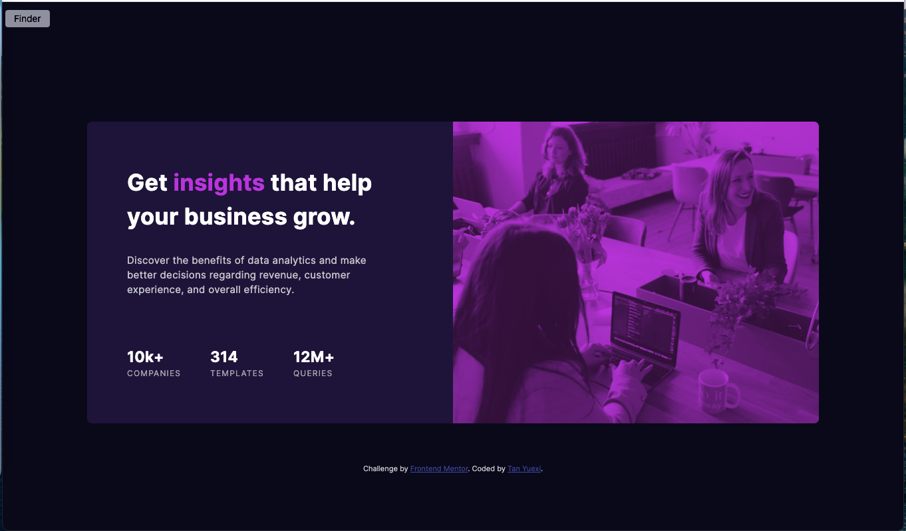

# Frontend Mentor - Stats preview card component solution

This is a solution to the [Stats preview card component challenge on Frontend Mentor](https://www.frontendmentor.io/challenges/stats-preview-card-component-8JqbgoU62). Frontend Mentor challenges help you improve your coding skills by building realistic projects.

## Table of contents

- [Overview](#overview)
  - [The challenge](#the-challenge)
  - [Screenshot](#screenshot)
  - [Links](#links)
- [My process](#my-process)
  - [Built with](#built-with)
  - [What I learned](#what-i-learned)
    - Use Sass to pre-process CSS
    - Selectors `>` and `+`
    - Resize image inside ``
    - To set the image to a color tone
    - Text manipulate: uppercase and letter space
  - [Continued development](#continued-development)


## Overview

### The challenge

Users should be able to:

- View the optimal layout depending on their device's screen size

### Screenshot




### Links

- Solution URL: <https://github.com/tanyuexi/frontendmentor-stats-preview-card/>
- Live Site URL: <https://tanyuexi.github.io/frontendmentor-stats-preview-card/>

## My process

### Built with

- Semantic HTML5 markup
- CSS custom properties
- Flexbox


### What I learned

#### Use Sass to pre-process CSS

Make codes more reusable and modular by put related codes in files named like '_color.scss'. Import and use them in *main.scss*:

```
// main.scss

@use 'base';
@use 'color';

.img-cover {
  background: color.$soft-violet;
}
```

To manage colors, it is convenient to generate classes for front/background colors: 

```
// _color.scss

$very-dark-blue: hsl(233, 47%, 7%);
$dark-desaturated-blue: hsl(244, 38%, 16%);

$colors: (
  'very-dark-blue': $very-dark-blue,
  'dark-desaturated-blue': $dark-desaturated-blue
);

@each $key, $value in $colors {
  .bg-#{$key} {
    background-color: $value;
  }

  .#{$key} {
    color: $value;
  }
}
```

#### Selectors `>` and `+`

To selector direct child `div` of class `.flex-container`:

```
// CSS

.flex-container > div {
  // direct children of .flex-container
}

.flex-container div {
  // all children of .flex-container
}
```

To selector immediate element after something:

```
// CSS

h1 + p {
  // first <p> after <h1>
}

div + div {
  // all successive <div>s except the first one. Useful to set space items.
}
```

#### Resize image inside ``

```
// main.scss

div {
  overflow: hidden;
  
  img {
    width: 100%;
    height: 100%;
    object-fit: cover;
    // adjust position if desirable:
    // object-position: center center;  
  }
}
```

#### To set the image to a color tone

```
// main.scss

div {
  background: color.$soft-violet;
  position: relative;

  img {
    mix-blend-mode: multiply;
    opacity: 0.75;
  }
}
```

#### Text manipulate: uppercase and letter space

```
// CSS

.legend {
  letter-spacing: 0.1em;
  text-transform: uppercase;
}
```

### Continued development

Develope a more efficient workflow for setting spacing.
